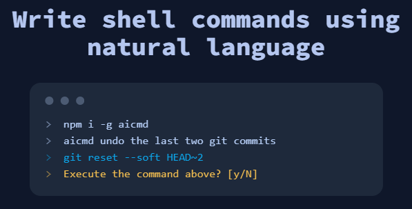

# AICMD
[](https://github.com/kunchenguid/aicmd/actions/workflows/build.yml)

A CLI program that allows you to write shell commands using nautral language.
* Supports all major OS and shells.
* Usage is free. No fees whatsoever.
* Open source. Pull requests welcome.



## Prerequisites
AICMD is based on Node.js. [Install Node.js](https://nodejs.org/en) before proceeding. Minimum required version is Node.js 16.

## Usage

Run it directly using npx:
```bash
npx aicmd create a javascript code file that prints hello world, and run it
```

Alternatively, install aicmd globally:
```bash
npm i -g aicmd
```

And then run it more easily each time:
```bash
aicmd create a javascript code file that prints hello world, and run it
```

Output:
```bash
echo console.log("Hello World!") > hello.js && node hello.js
Execute the command above? [y/N]
```

## Support me
[Buy me a coffee](https://www.buymeacoffee.com/kunchenxyz)